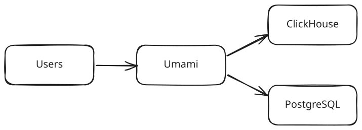
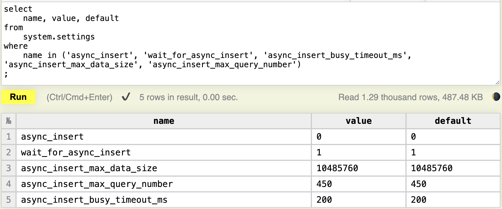
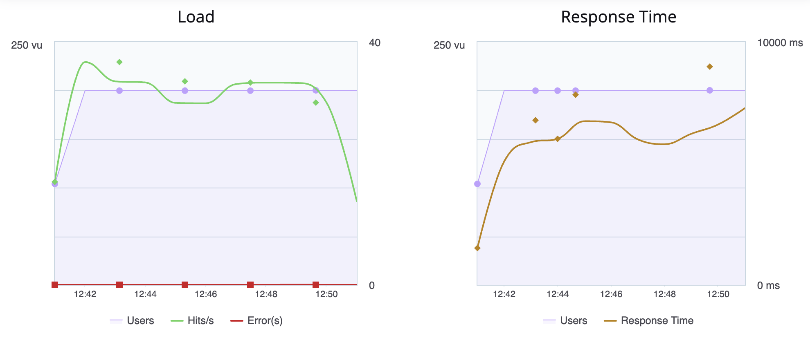
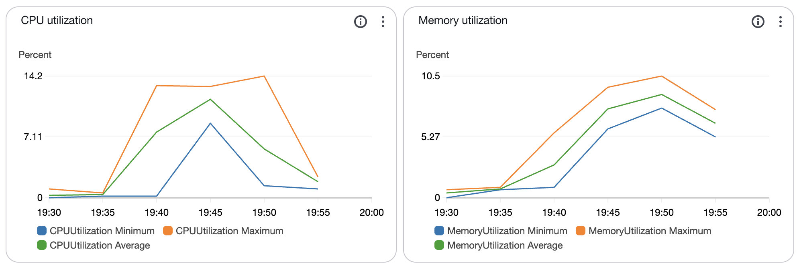
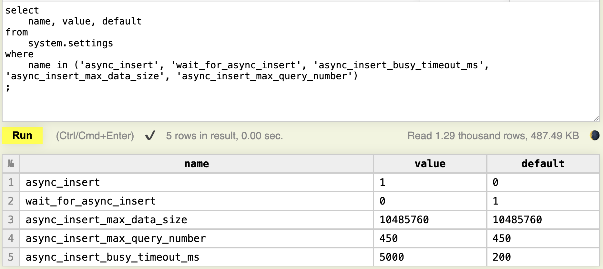
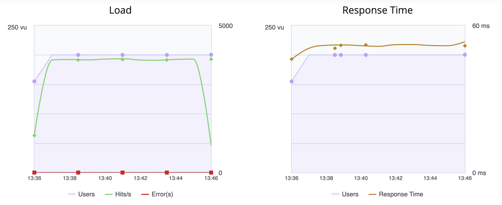
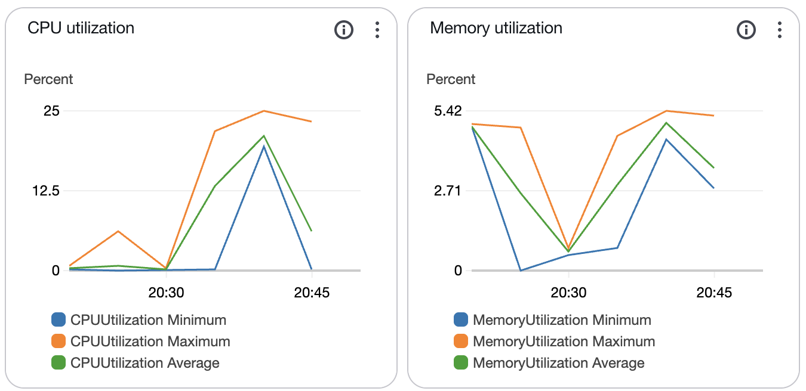

# Umami and ClickHouse Integration

## Introduction

My company needed a privacy-focused and self hosted website analytics platform which could handle upwards of 10M views per day.  Our solution inolves Umami and Clickhouse.

[Umami](https://umami.is/) is a self-hosted website analytics tool that allows you to control your data and adjust privacy settings. [ClickHouse](https://clickhouse.com/) is a columnar database designed for high-performance reporting on large volumes of data.  

### The Problem

Our goal was to scale Umami to handle up to 10 million views per day reliably and inexpensively.

The typical Umami setup using PostgreSQL or MySQL can encounter significant performance issues when scaling to high traffic levels. Through our experience, we've found that PostgreSQL starts to struggle with around 5 million total views. While PostgreSQL can easily record that number of views, reporting involves large `distinct(count())` queries and those may take several minutes.

### The Solution



ClickHouse offers a robust solution for analytics workloads, capable of efficiently handling large volumes of data. Our solution is to use ClickHouse as the backend for Umami.

Internally, Umami supports ClickHouse, but at the time of writing this document, there is no documentation about how to use these two together. There are a number of challenges we have faced. This document is not the only solution, but it has worked for us without introducing any significant complexity or maintenance costs.

Whether you're looking to scale Umami for a high-traffic website or searching for an effective self-hosted analytics solution, this guide provides the necessary steps and insights to get ClickHouse running with Umami at a general level. We will not go into running ClickHouse in a cluster, or other best practices.

For an alternative perspective, see [Another document about Umami and Clickhouse](https://boehs.org/node/umami-clickhouse).

### Key Topics:

- **Prerequisites**: Tools and knowledge required to start.
- **Setting Up ClickHouse with Umami**: Step-by-step guide to setup.
- **Enabling Async Inserts in ClickHouse**: Configuration details to optimize performance.
- **Performance Testing and Results**: Comparative analysis before and after enabling async inserts.
- **Supporting Files**: Docker configurations and ClickHouse snippets for seamless integration.

This documentation aims to offer a comprehensive yet approachable guide to integrating and optimizing Umami with ClickHouse, benefiting users seeking scalable analytics solutions.

## Prerequisites

Before starting, ensure you have the following:

- Docker and Docker Compose installed
- Access to clone the GitHub repository
- Basic knowledge of Docker and SQL

## Setting Up ClickHouse with Umami

### Quickstart

1. **Clone the Repository**:
    ```sh
    git clone https://github.com/querry43/umami-clickhouse-integration.git
    cd umami-clickhouse-integration
    ```

2. **Build and run the Docker Compose setup**:
    ```sh
    docker compose up
    ```

## The Importance of Async Inserts in ClickHouse

ClickHouse is highly optimized for handling large volumes of data with high performance. However, it prefers a small number of large inserts over a large number of small inserts. When faced with frequent small inserts, ClickHouse struggles with efficiency, resulting in performance issues.

### Symptoms and Impact

When we first integrated Umami with ClickHouse, we noticed significant delays and high failure rates on the Umami `/api/send` endpoint. Response times were upwards of 10 seconds, and reporting functionality was severely impacted. ClickHouse was generating a "Too many parts" error, indicating it was overwhelmed by the number of inserts. In all, it was unusable.

This error message lead us to the first part of the solution. [Exception: Too Many Parts](https://clickhouse.com/docs/knowledgebase/exception-too-many-parts) explains how ClickHouse organizes data and how that organization is impacted with many small writes.

### The Solution

ClickHouse provides a feature called asynchronous inserts (async_insert). This mechanism batches inserts in memory, allowing ClickHouse to handle large volumes of data more efficiently. While enabling async_insert can increase CPU load and memory usage, it significantly improves performance by reducing the overhead of managing multiple small inserts. [Asynchronous Data Inserts in ClickHouse](https://clickhouse.com/blog/asynchronous-data-inserts-in-clickhouse) goes into the details of why this works and what those costs are.

### Configuration Settings

To enable async inserts in ClickHouse, you need to update your configuration settings appropriately. This is the configuration used in the docker image from this repo [async-write.xml](./clickhouse/async-write.xml).

```xml
<clickhouse>
  <profiles>
    <default>

      <!-- https://clickhouse.com/blog/asynchronous-data-inserts-in-clickhouse -->

      <!-- enable async inserts -->
      <async_insert>1</async_insert>

      <!-- do not make the client wait for the insert to complete -->
      <wait_for_async_insert>0</wait_for_async_insert>

      <!-- write in memory records to disk every 5 seconds -->
      <async_insert_busy_timeout_ms>5000</async_insert_busy_timeout_ms>

      <!-- optimize record insertion speeds at the cost of reliability -->
      <async_insert_deduplicate>0</async_insert_deduplicate>
      <insert_deduplicate>0</insert_deduplicate>
      <optimize_on_insert>0</optimize_on_insert>

    </default>
  </profiles>
</clickhouse>
```


### Testing and Results

By enabling async inserts, we observed immediate improvements in performance. The response times for the `/api/send` endpoint reduced drastically, and the failure rates dropped. Reporting functionality became reliable and efficient.

## Performance Testing and Results

### Test Environment

- **Umami**: 24 instances of 2 vCPUs and 5 GB memory (eliminating Umami as the bottleneck)
- **Clickhouse**: 1 instance of 16 vCPU and 64 GB memory

### Test Parameters

- **Request**:
    ```bash
        curl \
            -H 'user-agent: Mozilla/5.0 (Macintosh; Intel Mac OS X 10_15_7) AppleWebKit/537.36 (KHTML, like Gecko) Chrome/137.0.0.0 Safari/537.36' \
            -H 'content-type: application/json' \
            -XPOST \
            https://example.com/api/send \
            --data-raw '{
                "type":"event",
                "payload":{
                    "website":"3e34840f-4d39-42a6-8cf1-123456789abc",
                    "screen":"1728x1117",
                    "language":"en-US",
                    "title":"My Site",
                    "hostname":"example.com",
                    "url":"https://example.com/",
                    "referrer":""
                }
            }'
    ```

- **Test Load**: 200 users split across 5 regions over a 10-minute test.

### Performance Without Async Inserts

We use default ClickHouse settings for async_insert:


During testing, we see an averate throughput of **32.34 Hits/s** with an average response time of **5893.96 ms** and 90% response time of **7439 ms**!


Clickhouse itself is not stressed:


What is most telling is what is on disk.  Before testing, we see the data directory is empty:

```bash
ls /var/lib/clickhouse/data/umami/website_event/

detached
format_version.txt
mutation_1.txt
mutation_2.txt
```

While tests are running, the file count in the directory spikes way up to over 6000.  It is hard to get an exact measurement because ClickHouse is creating many `tmp_2025*` and `delete_tmp_2025*` directories as it organizes data.  After around 10 minutes past test completion, the directory count is down to just 5 `2025*` directories remaining.

This behavior is explained well on [Clickhouse wants a small number of large writes](https://clickhouse.com/docs/knowledgebase/exception-too-many-parts).  To summarize, every insert results in a new directory or part.  In the background, ClickHouse merges those into bigger parts.  This is a compounding problem, because as it says:

> If you insert to lot of partitions at once the problem is multiplied by the number of partitions affected by insert.

### Performance With Async Inserts

Now we test using the async insert clickhouse settings [included in this repo](clickhouse/async-write.xml):


This test is also from a fresh ClickHouse instance and empty storage:

```bash
ls /var/lib/clickhouse/data/umami/website_event/

detached
format_version.txt
mutation_1.txt
mutation_2.txt
```

The result is a huge improvement.  We see an average throughput of **3668.88 Hits/s** (that's over 300M / day), with an average response time of **51.62 ms** and 90% response time of **92 ms**.


During that time, ClickHouse CPU usage reached 25% which feels totally reasonable.  Remember, this is a single ClickHouse instance, not a cluster.


During tests, the file count in the directory lingers around 150 files, going down to 11 shortly after tests completed.

```bash
ls /var/lib/clickhouse/data/umami/website_event/ | wc -l

11
```

These files have an average size of 20M which feels reasonable.

```bash
du -sk /var/lib/clickhouse/data/umami/website_event/2025* 2>/dev/null \
    | awk '{ sum += $1; n++ } END { if (n > 0) print sum / n; }'
20501.7
```

## Conclusion

Integrating Umami with ClickHouse using async inserts provides significant performance improvements for high-traffic websites. This is much easier to setup than Apache Kafka and can provide significant performance without a cluster of ClickHouse instances.

Good Luck!

## Contributing

We welcome contributions from the community! If you have suggestions, improvements, or want to share your experiences, please [start a discussion](https://github.com/querry43/umami-clickhouse-integration/discussions) or [submit a pull request](https://github.com/querry43/umami-clickhouse-integration/pulls).
